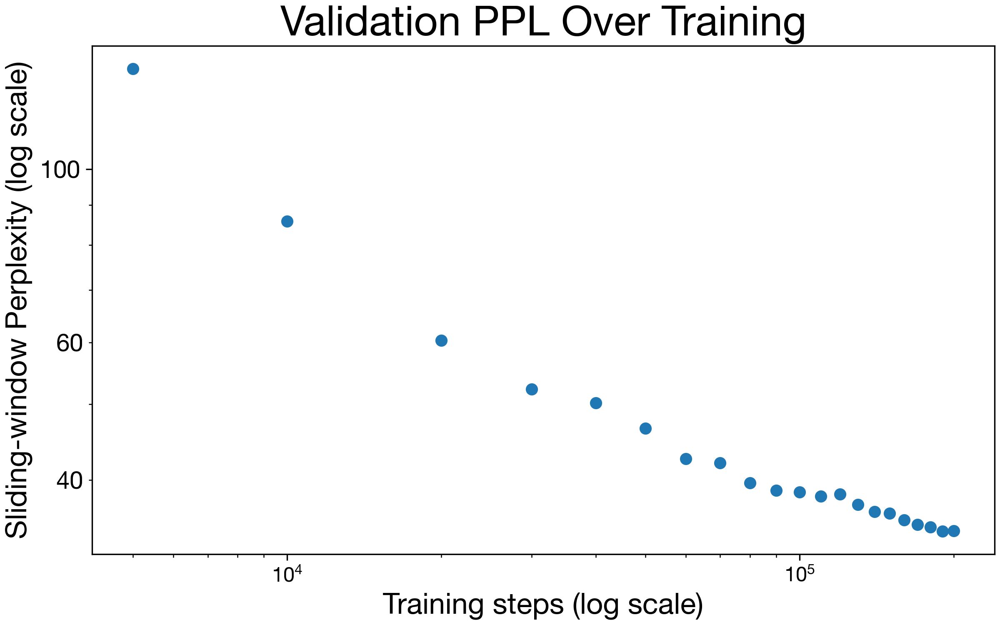

# scratch-former

Getting my hands dirty building a language model from scratch.

Intall with ` pip install -e .`
See [Usage](#usage) for how the libary works a description of the [scripts]()
that I use for training, inference, and other miscellaneous tasks.

## Introduction

Language models are increasing in power and usefulness at an incredible rate.
As a user of the commercial LLMs with some background in ML I have been tracking
the key developments at a high level but I felt there were some missing pieces in
my understanding when it came to actually getting an LM to work. This project set
out to address those gaps.

One major issue to address up front is what it means to make something "from scratch,"
after all as Carl Sagan says, "If you wish to make an apple pie from scratch, you must
first invent the universe" and something similar is true for transformer
models.

This implementation uses only what I consider to be core elements of pytorch to create
a gpt-2 like model. Core elements boils down to the autograd capability of torch
functions, `torch.nn.Module` for building the model, the `Adam` optimizer, and some
simple layers and activations (Linear, LayerNorm, ReLU). It is modular enough to support
building different text generation models and tries to strike a balance between
readability and functionality.

### Model

The model I train here is a 4-layer, decoder-only transformer. The Multi-Headed Self
Attention (MHSA) layer follows the description in Vaswani 2017 a nd uses
`d_model=512`, `d_ff=1024`, and a fixed sequence length of 256 tokens.

#### Training

- Follows LR schedule described in Vaswani 2017. Also uses label smoothing as described.
  No dropout for now.
- GPT-2 style prediction task with masked input.
- Dataset - Wikitext-2, randomly sample sequences. Join articles with `<|endoftext|>`.
  *NB* As of this writing it seems like the original links are broken. I grabbed the
  text from huggingface.
- Randomly sampled training sequences of 256 tokens with causal masking and predicting
  the next token at each position. I was working with pretty limited gpu resources so
  I used batch size of 10 sequences.
- I trained for 200k steps following the learning rate schedule described in Vaswami
  2017 with 4000 warmup steps.
- Saved model checkpoint every 10k steps.

#### Results

After training, this model achieves a sliding-window perplexity PPL of 34.423 on the
validation segment of the `wikitext2` dataset.
This is comparable to quoted values for models like
[`gpt2-small`](https://huggingface.co/openai-community/gpt2#evaluation-results) which achieves a perplexity of 29.41 on `wikitext2`. has about 10M more parameters than what I implement here and was of course trained on more data with more compute.

### Inference Strategies

I got particularly interested in the inference process for these autoregressive models
and implemented four different stratgies to see how they worked.
As I am writing this, the Boston Celtics are in the NBA playoffs and General Manager Brad Stevens happened to be in the `wikitext2` test segment so the examples below all try to continue his wikipedia page (more samples can be found [here](./content/run2.txt1).
Here are the first 256 tokens that seeds each of the
examples below:

>  = Brad Stevens =
>
>  Bradley Kent " Brad " Stevens ( born October 22 , 1976 ) is an American professional basketball head coach for the Boston Celtics of the NBA . He was previously the head coach at Butler University in Indianapolis . A former basketball player , he grew up in Zionsville , Indiana , where he starred on the Zionsville Community High School basketball team , setting four school records . After high school , he attended DePauw University , where he played basketball and earned a degree in economics . He made the all @-@ conference team multiple times and was a three @-@ time Academic All @-@ America nominee .
>
>  Stevens joined the Butler basketball program as a volunteer prior to the 2000 – 01 season after quitting his job at Eli Lilly and Company . He was promoted to a full @-@ time assistant coaching position for the 2001 – 02 season . On April 4 , 2007 , he became the head coach after Todd Lickliter left to coach the Iowa Hawkeyes . In his first year , Stevens led Butler to 30 wins , becoming the third @-@ youngest head coach in NCAA Division I history to have a 30 @-@ win season .
>
>  In 2010

**Greedy Samples**

I started where most do with greedy search: selecting the highest probability token as
the next token repeatedly.

>  , he was named to the All @-@ Star Team , where he was named to the All @-@ Star Team.
>
>  = = Early life = =
>
>  Stevens was born on April 28 , 1987 in the village of St. Louis , Missouri , to a young boy , and his wife ,

**Beam Search**

Beam search was often mentioned as a relatively easy improvement over greedy search:
instead of taking only the highest probability next token one tracks some fixed number
of most likely outputs updating the total log-probablity of the sequence as its
generated. The following was generated with a beam width of 10.

> Response:  and 2012 , he was named the 2012 NCAA Men 's Basketball Tournament Most Valuable Player of the Year .
>
>  = = Early career = =
>
>  = = = Early years ( 2012 – 13 ) = = =
>
>  Stevens attended the University of Michigan in 2012 , where he

In both the greedy and beam search cases its nice to see that model has learned how
wikipedia formatting works (with nested `=`s being used to format the headings).
They also manage to stay roughly on topic (discussing college basketball) and then
going into more detail about his life in (something like) chronological order.
Unsurprisingly they don't reproduce any accurate facts about Brad Stevens.

**Top-k Sampling**

Another interesting phenomenon was the way these models get caught in "loops," highly repetitive sequences.
The most common sampling stratgey is top-k sampling, where we keep only the k most
likely next tokens and sample randomly from that subset. Here is a sample with `k=128`:

> , Bradley was a Class 15A NBA All @-@ American select All @-@ Pro selection — the Young Player , and the Johnson brothers of the Class @-@ Gator Cup . He was the # 6 pick and 9th overall defensive selection .
>
>  = = = College career = = =

This is definitely more "surprising" to read but has a much harder time staying on the
topic.
As a quick follow up I also implemented temperature sampling: scaling the logits with a
"temperature" (referring of course to how temerature (kT) scales energies in the boltzmann distribution).
Low temperature sampling has the effect of boosting the probabilities of the more likely
next tokens and is widely used to improve sample quality. An example with `T=0.7`:

> , Stevens was named the starting quarterback and co @-@ captains for the 2008 – 09 season , making 12 appearances in the 2009 – 10 season . The team won the 2009 National Invitation Tournament with 14 wins .
>
>  = = Professional career = =

**Nucleus Sampling**

A final approach I explored was nucleus sampling
When I looked into the repetitive sequence issue, I found that it was a [well documented phenomenon](https://arxiv.org/abs/1904.09751).
The linked paper proposes nucleus sampling as a way to maintain the randomness of top-k
sampling while also dynamically adjusting for cases where there is more or less
uncertainty in the next token.
For each prediction, instead of sampling from the top k possible tokens, we sample from
the set of most probable tokens that cumulatively represent `p_nuc` of the total
probability mass.
This stratgey removes the need to set a fixed k value and includes more potential
tokens when there is more uncertainty and fewer tokens when there is less uncertainty.
This sample was generated with the authors suggested `p_nuc=0.95`:

> , he appeared at M @-@ 0 in the NCAA Division I Basketball Tournament in Bangkok , where he graduated from the high school .
>
> On September 5 , ída impecc Jack Brui , after his playing season against the Bob under @-@ /{{ leaked'Connor Amounts they married the teenager\_RAD of

These samples were a little disappointing but its probably just due to the fact that my
model has not seen enough data to have high enough certainty about what the next token
should be.
I hypothesize that these samples are made worse by using a large (\~ 100k tokens)
BPE vocabulary so there are still a lot of low probability tokens below the 95% threshold.

### Other things I learned along the way

**BPE Tokenization** BPE is a very clever solution that I did not appreciate at all before
starting this project. It was also the largest corner that I cut in this implementation.
When I was first learning about language modeling (ca 2017) word embeddings like GloVe were still
quite popular and that was actually where I started for this model.
Compared to GloVe, however, byte-level BPE reduces vocab size by about 3x and it
doesnt have to deal with any unknown tokens because all computerized text is represented in bytes.
I though about training a BPE but I was very enamored with
[`tiktoken`](https://github.com/openai/tiktoken) which besides
being written in rust (so fast and multithreaded) also has an incredible
[`educational`](https://github.com/openai/tiktoken/blob/main/tiktoken/_educational.py)
submodule that has a pedagical python implementation of byte-level BPE which is
everything I could have ever hoped to make. All that said, one thing I would change if
starting this over would be to use a tokenizer with a smaller vocabulary (there seems
to be some consensus emerging in the open-sourve LM world about using the llama2
tokenizer which has a vocab of approximately 32k tokens). A smaller vocab (especially
with weight tying between the embedding and output layer) would clear up a decent chunk
of memory that could be used for a bigger model).

**Cloud computing** I was surprised by how tricky it was to get high-end GPUs
(e.g. V/A/H100) on AWS.
In retrospect it is pretty reasonable to prevent new users to get on these
expensive GPUs when Amazon doesnt trust them to pay. I submitted one or two requests
to get access but didn't succeed I guess they want to see a track record of payments.
I ended up using paperspace where it was easy to get a lower level (RTX-4000) GPU.
It ended up costing about $20 to train this model which includes a solid chunk of
running the instance and debugging the ancient CUDA drivers it came with as well as
a few bucks for durable storage.
One closely related learning was that it seems to be worth paying for better
GPUs. The sticker shock of a couple $ per hour always gets me but in some very limited
tests with low-end hardware, I was able to achieve about a 5x speedup in training
iterations per second for about a 2x increase in cost/hour. I suspect this calculus
does not generalize very easily depending on the model size, GPU memory, and GPU
memory bandwidth but it certainly worth trying to figure out on a per-project basis.

### Interesting follow ups

Doing this project made me want to make training and inference more efficient.
After a bit of research it seems like a lot of the ideas I was considering were rolled
into Llama(2).

- Padded input sequences - I'm a slacker and didnt implement padding for variable length
  sequences so the model needs a full (256 in the base case) context window to do
  prediction. It would be good to workout the padding so one can prompt it in a
  chat-like interface.
- KV caching - Can this work with fixed sinusoid PE? Or need relative/rotary encoding
- Mixed precision - save memory during training and speed up inference. Also a
  preliminary read suggests this may be a 1-2 line adjustment with `torch.amp`
- Multi-Query attention - got this from reading the Llama2 paper but pretty amazing that
  it has such a minimal effect on model quality.
- Multi-GPU data parallel - I have avoided this for years but seems essential to take
  scaling law type steps.

The software engineer in me also got thinking about writing tests for ML projects. I'd
like to add a couple here for good measure but its definitely seems to be a different
set of challenges than I'd write for a library. Seems like the techniques are
- Check the shapes of outputs
- Check against some small dataset for consistency
- Harder to check that things are working they way they should i.e. testing your
  understanding. But a few of these would be good things like, for the causal model, the
predictions upstream of a change in the input should not change.

### Usage

**Module**

The module is organized into a few submodules:
- `layers` - Basic building blocks of a Transformer: Multi-Headed Self Attention,
  Residual Feed-forward networks, and Sinusoidal Positional Encodings.
- `model` - A full model that (somewhat) flexibly combines the layers into a
  decoder only transformer
- `data` - A super minimal data-loader function that randomly samples sequences of
  tokens from a corpus that is a numpy array of tokens.
- `sample` - functions that take a `Transformer` model object and generate new sequences
  via greedy search, beam search, top-k sampling, and nucleus sampling.

**Scripts**

- [`train.py`](./scratch_former/scripts/train.py) - train the basic model configuration on
  the wikitext2 dataset.
- [`validate.py`](./scratch_former/scripts/validate.py) - Iterates through saved model benchmarks and computes sliding-window
  perplexity for the validation set.
- [`generate.py`](./scratch_former/scripts/generate.py) - Test the different sampling
  strategies.

## References
Some of these are linked directly in the text but these are a combination of papers
I read over the course of this project and a few particularly good blog posts.
1. [Attention is All You Need](https://arxiv.org/abs/1706.03762)
1. [Language Models are Unsupervised Multitask Learners](https://d4mucfpksywv.cloudfront.net/better-language-models/language_models_are_unsupervised_multitask_learners.pdf) (a.k.a .the GPT-2 paper)
1. [Llama 2: Open Foundation and Fine-Tuned Chat
   Models](https://arxiv.org/abs/2307.09288)
1. [Rotary Position Embedding](https://arxiv.org/abs/2104.09864)
1. [Nucleus Sampling](https://arxiv.org/abs/1904.09751)
1. [Multi-Query Attention](https://arxiv.org/pdf/1911.02150)
1. [Microsoft Guide to ML
   Testing](https://microsoft.github.io/code-with-engineering-playbook/machine-learning/ml-testing/)
1. [The Annotated Transformer](https://nlp.seas.harvard.edu/annotated-transformer/) In the end I
   find this implementation too object oriented to be easily readable but Sasha Rush taught me a
   lot about ML and NLP in particular so shoutout to him and this generally great post.
1. [Less
   Wrong](https://www.lesswrong.com/posts/2kyzD5NddfZZ8iuA7/implementing-a-transformer-from-scratch-in-pytorch-a-write#Useful_resources_if_you_re_implementing_the_Transformer_from_scratch)
Meta post about doing a similar project. The gotchas section is particularly useful (I
for sure had all my attention blocks in a regular python list before realizing I needed
to use `torch.nn.ModuleList`)
